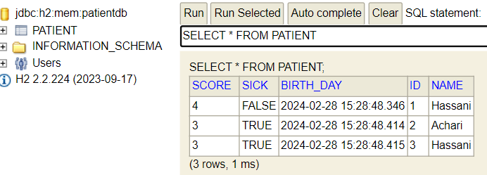
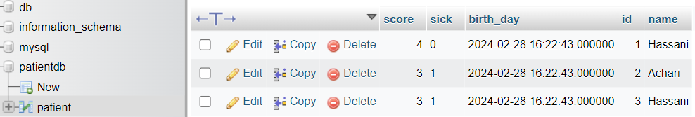
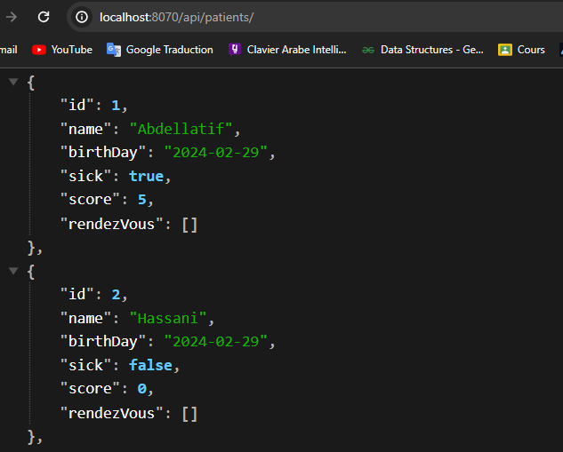

# Hibernate ORM Implementation with Spring Data

This repository demonstrates the implementation of Hibernate ORM (Object-Relational Mapping) using Spring Data.

## Steps Covered:

1. **Creating JPA Entities**: Define entity classes to map database tables.
2. **Implementing JpaRepository**: Implement repository interfaces to perform CRUD operations.
3. **Configuring Database**: Configure database connection properties using `application.properties`.
4. **Testing**: Creating a simple test App.
5. **Database Migration**: Migration from H2 in-memory database to MySQL.
6. **Creating RESTful API**: Define RESTful API endpoints in a controller class to handle HTTP requests and return data from the database.

## Technologies Used:

- Java
- Spring Data JPA
- Hibernate ORM
- H2 Database (for testing)
- MySQL

## Screenshots

