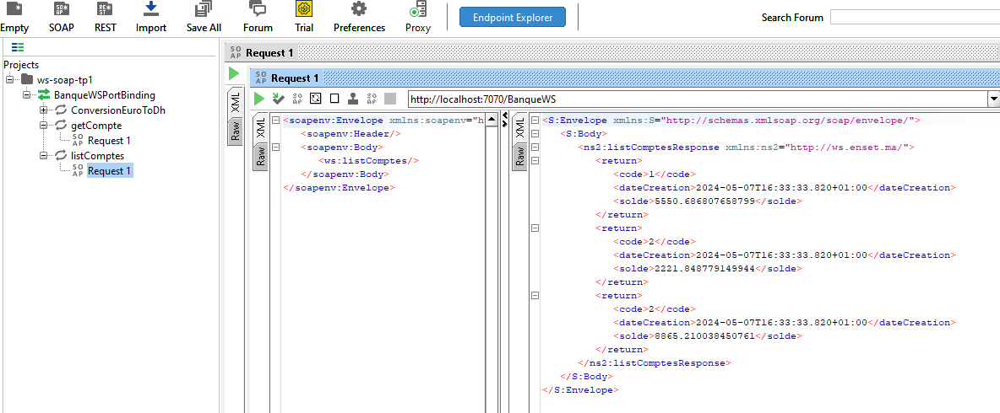
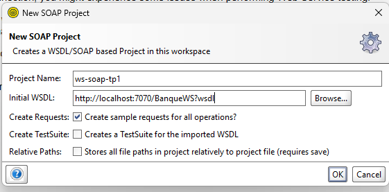
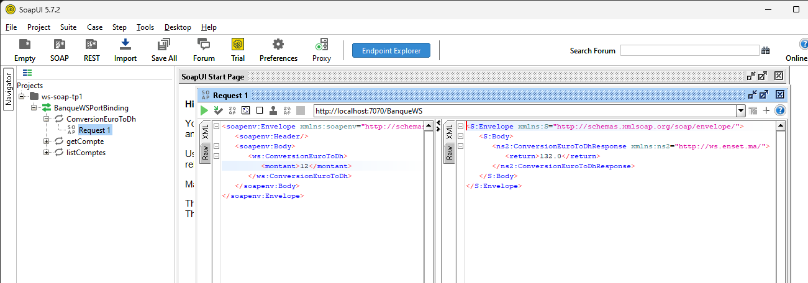
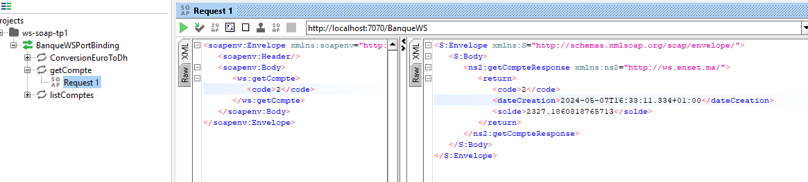

# SOAP Web Service Using JAX-WS

This repository contains an example of implementing a SOAP-based web service using the JAX-WS library. It demonstrates the generation of WSDL (Web Services Description Language) and testing the web service using SOAP UI.

## Steps Covered:

1. **Definition of Web Service Interface with JAX-WS:**
   - Created a Java interface annotated with JAX-WS annotations to define the web service contract.
   - Implemented methods representing the operations exposed by the web service.

2. **Generation of WSDL:**
   - Generated WSDL (Web Services Description Language) file using the JAX-WS tools.
   - Reviewed and customized the generated WSDL to suit the requirements of the web service.

3. **Implementation of Web Service Endpoint:**
   - Developed a web service endpoint class to implement the methods defined in the web service interface.
   - Annotated the endpoint class with JAX-WS annotations to specify its properties and behavior.

4. **Deployment and Testing:**
   - Deployed the web service to a server or application container.
   - Tested the functionality of the web service using SOAP UI or other testing tools.

## Screenshots

